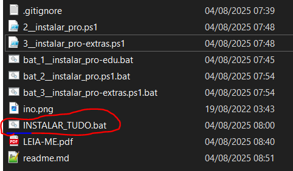
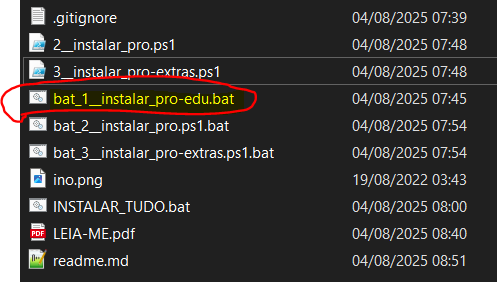
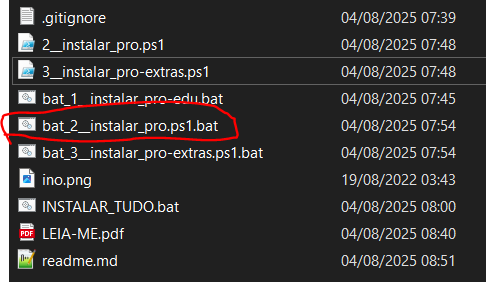
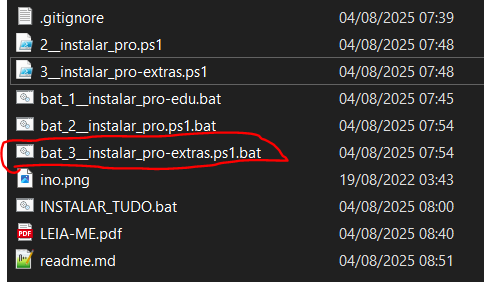
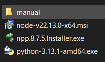

# Projeto para instalação rápida dos programas  essenciais nas estações techs

> - *AUTOR*: **Luis Eduardo (@djedu28)** - <https://github.com/djedu28>
> - *PROJETO HOSPEDADO EM*: <https://github.com/djedu28/pro-edu-estacao-tech>
>

> - *LICENÇA* dos scripts de Automação: MIT
>   - ou seja, o script são fornecidos "NO ESTADO EM QUE SE ENCONTRA", SEM GARANTIA DE QUALQUER TIPO, EXPRESSA OU IMPLÍCITO. O AUTOR não se responsabiliza por danos causados por sua utilização. Nem pelos efeitos adversos que a execução dos mesmos possam vir a causar. USE POR SUA PRÓPRIA CONTA E RISCO. Para mais informações da licença MIT, [clique aqui](https://github.com/djedu28/pro-edu-estacao-tech/blob/main/LICENSE)
>
> ⚠️🚨ATENÇÃO⚠️🚨
>
> - LICENÇA dos PROGRAMAS INSTALADOS:
>
>   - Os programas aqui automatizados a instalação são de propriedade dos seus respectivos autores e/ou detentores dos direitos, e possuem licenças próprias.
>   - Com a automação da instalação, você aceita todos os termos e condições de uso dos programas instaladas.
>

## Para INSTALAR TUDO

Para executar a instalação de tudo, execute o arquivo: `INSTALAR_TUDO.bat` (clicando duas vezes com o mouse no arquivo)

ou em caso de necessidade, você pode executar manualmente as etapas. (abaixo apresento cada uma delas)

----

⚠️🚨Aviso:⚠️🚨 Existem programas extras e **opcionais** que não instalados automaticamente, salvos na pasta [PRO/extras/manual](PRO/extras/manual), são eles:

- `7Zip` - compactador e descompactaodr de arquivos;
- `Creality Slicer` fatiador de arquivos 3D;
- `Fusion 360` - modelagem 3D
  - (o Fusion requer internet e autenticação)
    Ainda de modelagem 3D, recomendo o `Blender`

## Etapas da instalação

### Etapa 1

Executa a instalação dos programas edu = educação

> SCRIPT: `./bat_1__instalar_pro-edu.bat`
> 
>> comando manual: `cmd /C "./bat_1__instalar_pro-edu.bat"`

- **Arduino e os drivers** - Usado para aulas de robótica;
- atalhos para **plataforma educacional** `InovOnline` - <https://inovonline.vercel.app>;
- **Ultimaker Cura** - programa usado para impressão 3D;

### Etapa 2

instala os programas essenciais para a estacão tech
> SCRIPT: `./bat_2__instalar_pro.ps1.bat`
> 
>> comando manual: `cmd /C "bat_2__instalar_pro.ps1.bat"`

- leitor de pdf `PRO/AdbeRdr11000_pt_BR.exe`
- navegador `PRO/ChromeStandaloneSetup64.exe`
- navegador `PRO/Firefox Setup 119.0.1.exe`
- Java `PRO/jre-8u391-windows-i586.exe`
- Reprodutor de video/musica `PRO/MPC-HC.1.7.9.x86.exe`
- compactador e descompactador de arquivos `PRO/winrar-x64-620br.ex`

### Etapa 3

Instala os programas extras para a estacão tech
> SCRIPT: `./bat_3__instalar_pro-extras.BAT`
> 
>> comando manual: `powershell -ExecutionPolicy Bypass -File "./3__instalar_pro-extras.ps1"`

  

   <!--  -->
   
  

  

- **NodeJs** - `PRO/extras/node-v22.13.0-x64.msi`
- **Notepad++** - `PRO/extras/npp.8.7.5.Installer.exe`
- **Python** - `PRO/extras/python-3.13.1-amd64.exe`

  

### Etapa 4

a etapa 4, não é instalação de programas, mas sim configuração
os scrips encontram-se na pasta  [papel_de_parede](papel_de_parede)

- para ativar o papel de parede
    > script `z__ativar_papel_de_parede.bat`
    >> comando manual: `cmd /C papel_de_parede/z__ativar_papel_de_parede.bat`

- para desativar o desligamento do monitor
    > script `z__configura_para_nao_desligar_monitor.bat`
    >> comando manual: `cmd /C papel_de_parede/z__configura_para_nao_desligar_monitor.bat`
